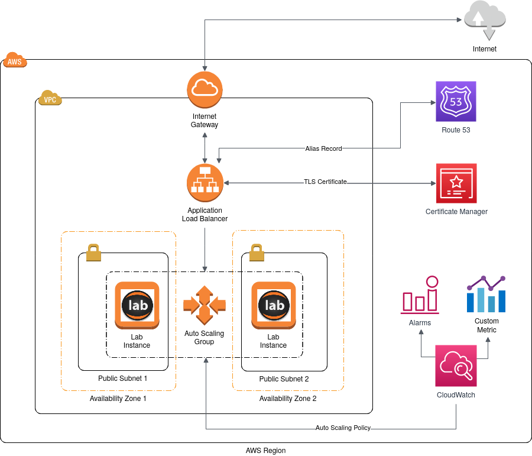

# JupyterLab on AWS

This repository contains the Terraform code to deploy the AWS Lab: an infrastructure on Amazon Web Services that allows users to do data analysis via the JupyterLab interface.

The public-facing component of the infrastructure is an Application Load Balancer (ALB), which is associated to a configurable domain name via a Route 53 alias record. The ALB also gets a verified TLS certificate via the Certificate Manager service.

Traffic is forwarded from the ALB to a set of EC2 instances. Each instance is created from an image (AMI) with JupyterHub, where users can log in and start JupyterLab sessions in Docker containers, based on a container image that includes libraries for data analysis in Python, R and Julia ([jupyter/datascience-notebook](https://hub.docker.com/r/jupyter/datascience-notebook/)).

The EC2 instances belong to an auto scaling group, for which auto scaling policies are defined depending on the average number of user sessions per instance (a custom metric). As new users log in and start their JupyterLab sessions, an alarm created in CloudWatch triggers an automatic scale-up action to increase the capacity of the instance group accordingly. Similarly, when the custom metric goes below a certain threshold, scale-down is applied.

The figure below shows the architecture of the AWS Lab.

